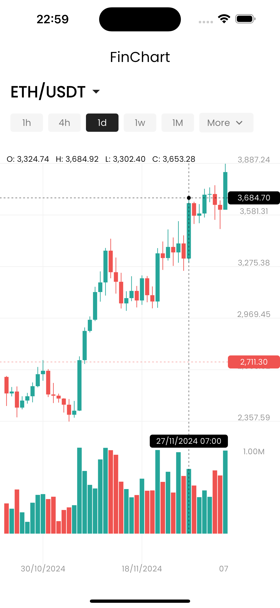
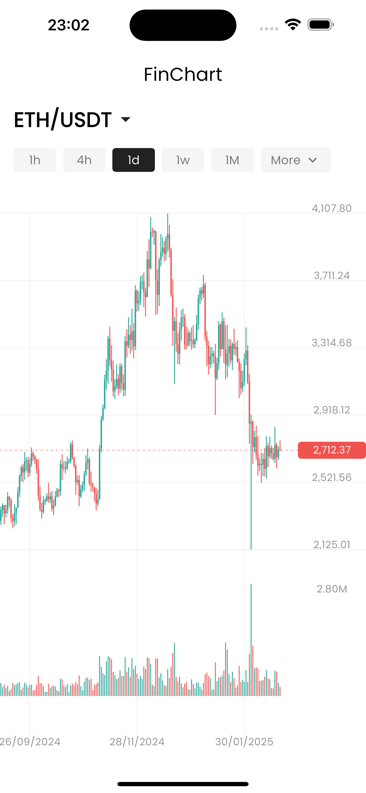
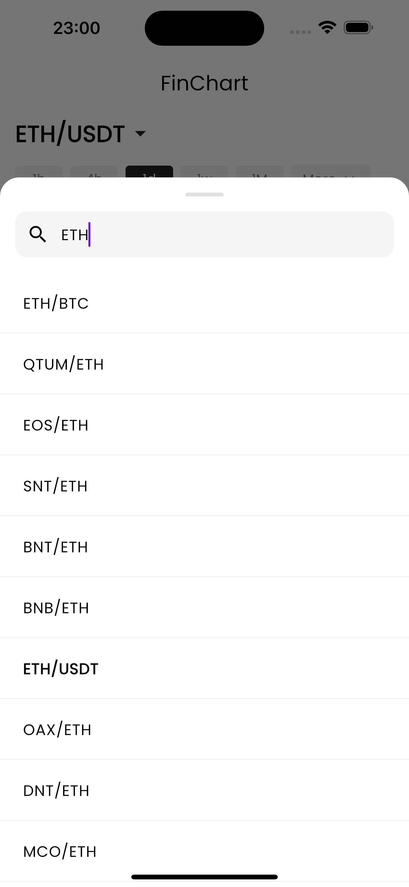
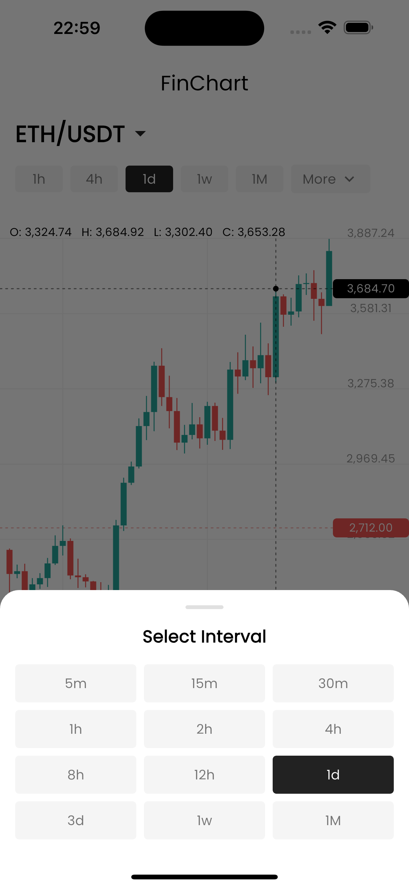

# FinApp

My personal playground in Flutter, built from scratch to tinker with candlestick charts and real-time Binance API data without using charting packages. Inspired by **Binance App**, this project delivers an elegant, minimalist UI. Every pixel, every interaction had to be **manually calculated and optimized**.

## 1. Key Features

- ✅ **Self-built Candlestick Chart** – No dependencies. Drag, zoom, and crosshairs, all crafted by hand
- ✅ **Large Dataset** - Ensures good performance on heavy data
- ✅ **Live Chart Updates** – Real-time candlestick data with smooth animations
- ⏳ **Live Symbol List** – Real-time price tracking for thousands of trading pairs with efficient viewport rendering
- ⏳ **Technical Indicators** – Upcoming enhancements featuring moving averages and trend lines for deeper market analysis.

## 2. The Challenge

### 2.1 Candlestick Chart

Crafting a candlestick chart from scratch is far from simple. Unlike static UI components, a candlestick chart requires:  

- **Optimized Rendering** – To optimize performance, the chart must avoid drawing off-screen elements. Every candle, grid line, and label should be conditionally drawn based on the viewport.
- **Precision Coordinate Translation** – Each price movement must be accurately translated into screen coordinates.
- **Robust Data Optimization** – Keeping performance smooth even with thousands of candles.
- **Real-time Updates** – Ensuring smooth animations and preventing UI lag.  
- **Touch Interactions** – Pinch-to-zoom, crosshairs, and dynamic scaling.

This required deep optimization techniques, manual calculations, and careful use of **Flutter's CustomPainter** to keep performance smooth without relying on external libraries.  

### 2.2 Symbol List

Displaying a **real-time symbol list** with prices introduces another layer of complexity:  

- **Selective Updates** – Avoid re-rendering the entire list when only a few symbols update.
- **Dynamic WebSocket Management** – Subscribe to visible symbols and unsubscribe from off-screen ones to optimize performance and reduce network load.
- **Scalability** – Binance supports thousands of trading pairs, meaning updates come in fast and frequently. A naive approach could overwhelm the app with unnecessary UI rebuilds.  

This part of the project demands a smart **state management strategy**, along with techniques like **lazy loading, viewport tracking, and granular updates** to ensure smooth performance.

## 3. Tech Stack

- **Flutter** (Stack and CustomPainter for chart drawing)
- **WebSocket & REST API** (for real-time Binance data)
- **State Management** (Riverpod and MVVM architecture)

## 4. Screenshots

| Crosshair Indicators | ZoomOut |
|---|---|
|  |  |

| Symbol Picker | Interval Picker |
|---|---|
|  |  |

---

Built with ❤️ and a lot of math in **Flutter**. Contributions & feedback are welcome!
